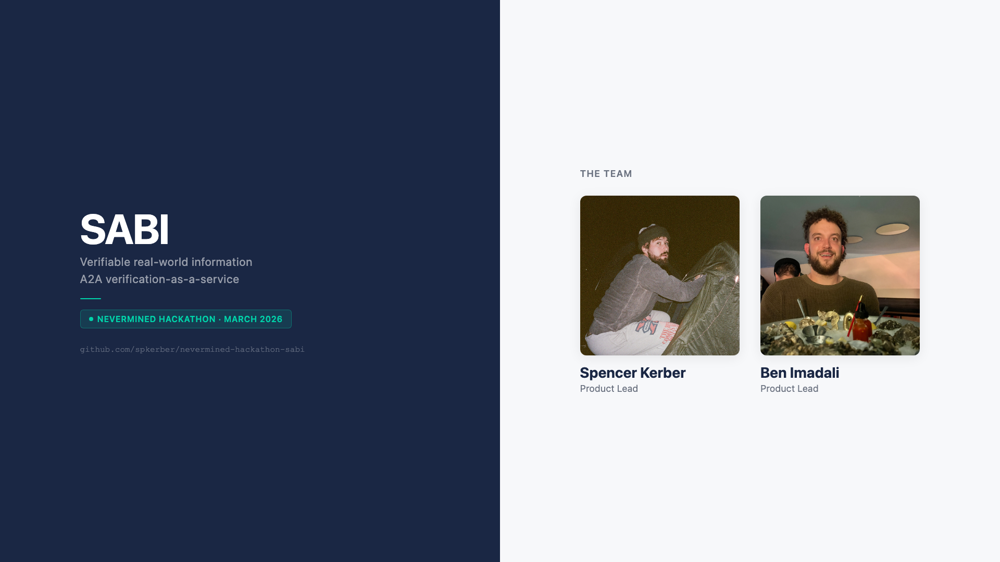
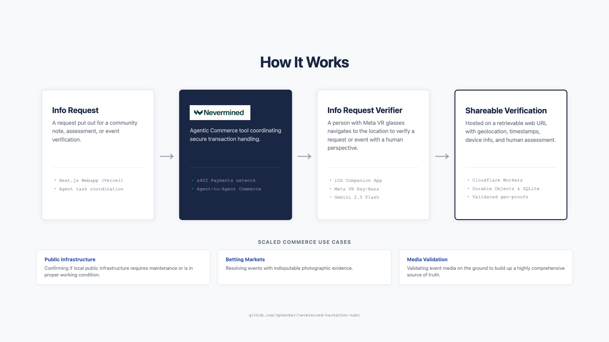
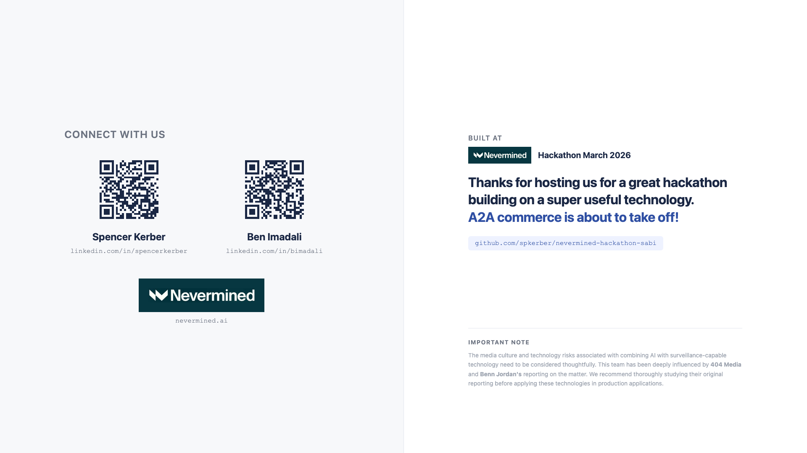

# Nevermined Hackathon - Sabi — Verifiable Real-World Information

**[Watch the demo in action →](https://www.youtube.com/watch?v=wxCQB--9uc8)**

We're Spencer Kerber and Ben Imadali. We worked on this project "Sabi" for the Nevermined hackathon and ended up getting awarded Best Autonomous Seller Agent. 

Sabi delivers verifiable, photo-backed answers for questions about the physical world — like a community note, but on demand and paid. Requesters submit questions; nearby verifiers with Ray-Ban Meta glasses go check, capture evidence, and answer.



Sabi enables agent-to-agent transactions by pairing requests for visual proof with local verifiers. An agent asks a question and pays via the marketplace. A nearby user with a Meta Ray-Ban headset picks it up, providing device timestamps, geolocation, and human perspective to validate the scene. That answer goes back to the requesting agent as a URL with access to protected proof assets that resolve the question. Here's the proof — the photos that were captured and the attested answer.

This scaled commerce unlocks real-world proof on demand. Use cases include confirming if public infrastructure actually requires maintenance, resolving current events and betting markets with indisputable evidence, or validating media on the ground to build a more comprehensive source of truth.



*Requester Agent → Marketplace (SABI) → Verifier with Ray-Ban Meta glasses*



*Thanks to the Nevermined team for hosting us at their hackathon. We had a great time and are happy to chat if you have questions about our work or ideas.*

> This code was initially written for the Nevermined A2A Commerce Hackathon (March 2026). It will only receive updates to clean it up and make it more accessible/readable as a reference project. The app itself is a demo and is not intended for production use.

## Live deployment

| Component | URL |
|-----------|-----|
| **Webapp (Vercel)** | [https://webapp-psi-inky.vercel.app](https://webapp-psi-inky.vercel.app) |
| **Docs** | [https://webapp-psi-inky.vercel.app/docs](https://webapp-psi-inky.vercel.app/docs) |
| **Backend (Cloudflare Workers)** | [https://sabi-backend.ben-imadali.workers.dev](https://sabi-backend.ben-imadali.workers.dev) |

## Quick start

### Backend (Cloudflare Workers)

```bash
cd backend
npm install
npx wrangler dev --port 8787
```

### Webapp (Next.js / Vercel)

```bash
cd webapp
npm install
npm run dev
```

The webapp connects to the backend at `http://localhost:8787` by default. For production (Vercel), set `NEXT_PUBLIC_API_URL=https://sabi-backend.ben-imadali.workers.dev` in Vercel env vars.

### Companion app (iOS -- iPhone + Ray-Ban Metas)

1. Open `companion/CameraAccess.xcodeproj` in Xcode
2. Copy `companion/CameraAccess/Secrets.swift.example` to `companion/CameraAccess/Secrets.swift` and fill in your Gemini API key and backend URL
3. Select your iPhone as the build target
4. Build and run

The companion app connects to the backend to accept verification jobs, streams camera from Ray-Ban Meta glasses (or iPhone camera in test mode), uses Gemini 2.5 Flash for real-time AI-assisted verification, captures photos every 5 seconds, and uploads them to the backend when the verification is complete.

## Architecture

```
webapp/           Next.js (Vercel) -- requester UI
backend/          Cloudflare Workers + Agents SDK
  src/index.ts    Worker entry point (REST API + agent routing)
  src/verification-agent.ts   Durable Object (SQLite + WebSocket state sync)
  src/types.ts    Shared types
companion/        iOS app (VisionClaw fork) -- verifier companion
  CameraAccess/   Swift source code
  CameraAccess.xcodeproj   Xcode project
docs/             PRD, references, team info
```

### API endpoints

| Method | Path | Description |
|--------|------|-------------|
| GET | `/health` | Health check |
| POST | `/api/verifications` | Create a verification job |
| GET | `/api/verifications/:id` | Get job status |
| POST | `/api/verifications/:id/accept` | Verifier accepts job |
| POST | `/api/verifications/:id/start` | Start verification session |
| POST | `/api/verifications/:id/frames` | Upload a frame (JPEG) |
| POST | `/api/verifications/:id/end` | End session with answer |
| GET | `/api/verifications/:id/artifact` | Get completed artifact |
| GET | `/api/frames/:key` | Serve frame image from R2 |
| WS | `/agents/verification-agent/:id` | Real-time status updates |

### Job status lifecycle

`connecting` -> `accepted` -> `in_progress` -> `verified`

### Tech stack

| Layer | Choice |
|-------|--------|
| **Backend** | Cloudflare Workers + Agents SDK (Durable Objects, SQLite, R2) |
| **Webapp** | Next.js on Vercel |
| **Payments** | Nevermined (x402) -- wired but payment validation deferred |
| **Companion app** | VisionClaw fork (iPhone + Ray-Ban Metas) |

## Team

- **Spencer Kerber**
- **Ben Imadali**

Ben has access and may push from a separate git worktree; pull from `origin` before redoing the PRD.

## Secrets & config

We use **Doppler** for API keys and secrets. For local dev you can still use `.env` (copy from `.env.example`); in CI/deploy, inject via Doppler. Nevermined credentials: `NVM_API_KEY`, `NVM_AGENT_ID`, `NVM_PLAN_ID` (create plan in [Nevermined App](https://nevermined.app)). See [docs/doppler-and-env.md](docs/doppler-and-env.md) and [docs/sandbox-to-prod.md](docs/sandbox-to-prod.md).

### Deployed URL (Cloudflare → Doppler)

Our backend is deployed at `https://sabi-backend.ben-imadali.workers.dev`. To point the seller and hackathon listing at it:

1. **Doppler:** Set **`APP_URL`** to `https://sabi-backend.ben-imadali.workers.dev` (no trailing slash).
2. **Re-register:** Run `npm run register-agent` with that `APP_URL` so Nevermined has the correct endpoint.
3. **Marketplace:** In the hackathon dashboard, set **Endpoint URL** to `https://sabi-backend.ben-imadali.workers.dev/query`.

Details: [docs/doppler-and-env.md](docs/doppler-and-env.md#using-your-cloudflare-deployment-url), [docs/hackathon-registration-checklist.md](docs/hackathon-registration-checklist.md).

## Docs

- [docs/PRD.md](docs/PRD.md) -- Full product requirements
- [docs/design-tokens.md](docs/design-tokens.md) -- Brand and color tokens (A11y, Berkeley Mono–inspired)
- [docs/references.md](docs/references.md) -- Hackathon and Nevermined links
- [docs/team.md](docs/team.md) -- Team info

Demo video (Remotion, Eleven Labs, brand assets) lives in a separate repo: [nevermined-hackathon-demo-video](https://github.com/spkerber/nevermined-hackathon-demo-video).

## Buyers / Sellers agents (feature branch)

On branch `feature/buyers-sellers-agents`: minimal **seller** (Express API with x402) and **buyer** (order plan + call seller) for sandbox → prod payment flow. No VisionClaw integration.

- **Register agent (once):** `npm run register-agent` — requires `NVM_API_KEY`, `BUILDER_ADDRESS`; writes `NVM_AGENT_ID`, `NVM_PLAN_ID` to add to Doppler.
- **Run seller:** `doppler run -- npm run seller` — serves `POST /query` with payment validation (402 without `payment-signature`).
- **Run buyer:** `doppler run -- npm run buyer:order-and-call "Your question"` — same key and config; orders plan, gets x402 token, calls seller.

**Quick test (same key):** Terminal 1: `doppler run -- npm run seller`. Terminal 2: `curl -X POST http://localhost:3000/query -H "Content-Type: application/json" -d '{"prompt":"Hi"}'` (expect 402), then `doppler run -- npm run buyer:order-and-call "Hi"` (expect 200 + result). See [docs/doppler-and-env.md](docs/doppler-and-env.md) for full steps. To **buy from another team’s agent** and stash the response: [docs/buy-from-another-agent.md](docs/buy-from-another-agent.md).

Refs: [5-Minute Setup](https://nevermined.ai/docs/integrate/quickstart/5-minute-setup), [Nevermined App](https://nevermined.app/permissions/global-permissions), [Doppler](https://dashboard.doppler.com/workplace/37ee0f06177aa6997f55/projects/nevermined-hackathon-sabi).

## License

MIT.
